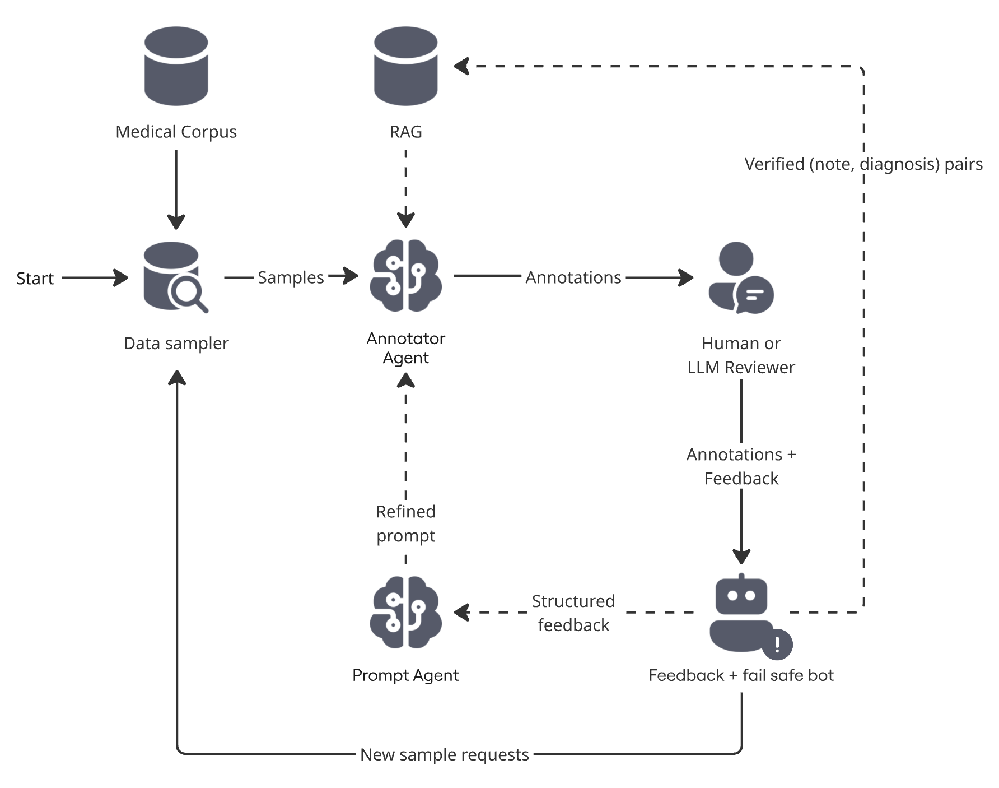

# Agentic Human-in-the-Loop Medical Annotation Framework

A research framework for iterative, human-in-the-loop (HITL) refinement of
LLM-based medical text annotators. Built for the MSc thesis project
*"How can a human-in-the-loop feedback mechanism improve the accuracy and
reliability of medical text annotations generated by LLM-based agents?"*
(TU Delft, 2026).

The goal is **not** to maximise raw annotation accuracy. It is to study
*how structured human feedback*, routed into prompt-level changes and a
retrieval-augmented memory, shapes the behaviour of LLM annotators across
iterations, while keeping evaluation strictly external to the system
under study.

## Headline empirical findings

Across five HITL conditions (Baseline, CoT, Few-shot, Self-consistency,
RAG) run for three iterations each at n=50 against MIMIC-III primary
ICD-9 codes:

- **Lenient accuracy converges to a tight [0.86, 0.90] band** at
  iteration 3 regardless of which prompt-engineering technique is
  layered on top of the loop.
- **No per-technique strict-accuracy difference is statistically
  resolvable at n=50** (iteration-to-iteration noise band ≈ ±17pp).
- **Missed-entity errors dominate the failure budget** (mean 67%, range
  42–91% per iter; modal in 14 of 15 iterations); only the plain
  `baseline_hitl` condition shows a monotonic reduction across
  iterations.
- The persistent **~18pp clinical-chapter strict/lenient gap** (0.67 vs
  0.85 on the human-reviewed n=100 baseline) is a property of
  MIMIC-III's billing-primary gold-label regime, not of the annotator.

The paper itself (LaTeX sources, figures, write-up) lives outside this
repository, `docs/` is gitignored.

## System architecture



Every iteration is logged: per-case JSON dataframes go to
`logs/experiments/<condition>/<run_id>.json` and prompts get
version-stamped in `logs/prompts/`. Evaluation is performed *outside* the
loop by scripts that consume only those log files. Per-case logs embed
MIMIC-III note text and are **not** redistributed under the PhysioNet
credentialled DUA; reproduction requires a credentialled MIMIC-III copy.

## Repository layout

```text
src/
  main.py                       # entry point; experiment configs and CLI
  performance_evaluator.py      # accuracy/reliability aggregation
  modules/
    annotator_agent.py          # LLM annotator (Gemini, technique toggles)
    sampler_agent.py            # stratified MIMIC sampling with reserved holdout
    auto_reviewer.py            # LLM-as-judge with response-schema enforcement
    human_reviewer.py           # interactive Tkinter review UI
    feedback_parser.py          # parses verdicts into routed signals
    prompt_agent.py             # generates instruction-level prompt patches
    rag_memory.py               # Google File Search-backed RAG store
    annotation_store.py         # per-case records + RAG-record construction
    technique_config.py         # technique toggle dataclass
    logger.py                   # event log

logs/
  prompts/v1_initial.json       # tracked; all HITL trajectories start here
  prompts/v*_auto.json          # gitignored; produced by PromptAgent
  experiments/                  # gitignored; per-run dataframes + summaries
  rag_stores/                   # gitignored; per-condition RAG store IDs
```

## Setup

1. **Python 3.11+**. Create a virtualenv and install dependencies:

   ```bash
   python3 -m venv .venv
   source .venv/bin/activate
   pip install -r requirements.txt
   ```

2. **Gemini API key.** Create `secrets.toml` in the project root:

   ```toml
   [api]
   key = "your-google-ai-studio-key"
   ```

3. **MIMIC-III access.** PhysioNet credentialing + signed DUA required.
   Place the source CSVs under `data/new/`:

   ```text
   data/new/NOTEEVENTS.csv
   data/new/DIAGNOSES_ICD.csv
   data/new/D_ICD_DIAGNOSES.csv
   ```

   Then run the one-time preprocessor to build the canonical parquet,
   producing `data/new/processed/notes_with_gold.parquet`, which the
   sampler reads at runtime (one row per admission, joined with primary
   ICD-9 SEQ_NUM=1 and human-readable titles, chapter-tagged).

## Running experiments

### Interactive CLI

```bash
PYTHONPATH=src python3 src/main.py
```

Menu options:

- `1` single run (one condition, one iter, n samples)
- `2` multi-run (one condition, N improving iters)
- `3` ablation study (all conditions × 1 iter, snapshot comparison)
- `4` longitudinal study (all conditions × N iters, *the main protocol*)
- `5` prompt diff (visualises any patch file)

Each option prompts you to pick `Auto` (LLM-as-judge) or `Human`
(interactive Tk UI) review mode. For the RAG condition, the multi-run
prompt additionally asks whether to warm up the retrieval store with one
preparatory annotate-and-review pass before iteration 1 (no prompt patch
applied from the warm-up).

### Reproducing the paper's HITL trajectories

The five HITL conditions reported in the paper (n=50 × 3 iters each)
were produced through the CLI's longitudinal-study option (menu choice
4) with `Auto` reviewer mode. Per-iteration prompts and hyperparameters
are detailed in the paper's reproducibility appendix. Per-case JSON
records embed MIMIC-III note text and are not redistributed; reproducing
the reported numbers requires a credentialled MIMIC-III copy and
re-running the loop against it.

### Adding a new HITL technique

1. Add a `TechniqueConfig(...)` entry to `EXPERIMENTS` in
   [src/main.py](src/main.py).
2. Add a corresponding entry to `RAG_STORE_PATHS` (use `None` if your
   technique doesn't use RAG).
3. The longitudinal driver picks it up automatically.

### Auto-reviewer vs human-reviewer

Both implement the same `.review(annotation, medical_note, gold,
case_num, total_cases) → dict` interface. The auto-reviewer
([src/modules/auto_reviewer.py](src/modules/auto_reviewer.py)) calls
Gemini 2.5-flash with a schema-enforced judgment prompt; the human
reviewer ([src/modules/human_reviewer.py](src/modules/human_reviewer.py))
opens a Tkinter UI. Judge-vs-author agreement was validated on the
hand-reviewed n=100 baseline at Cohen's κ = 0.82 (strict) and 0.77
(lenient); see paper §3.4.

## Evaluation philosophy

- The annotator's gold labels are MIMIC-III's billed primary ICD-9 codes
  (SEQ_NUM=1). Hospital coders assign these following DRG billing
  conventions, they are **not** clinically authoritative. We therefore
  always report **strict** (vs SEQ_NUM=1) *and* **lenient** (vs any
  billed ICD-9) accuracy side by side.
- Admin-chapter admissions (V-codes, Perinatal, Symptoms/ill-defined)
  are excluded from the clinical-annotation metric because their primary
  code is administrative by convention rather than clinical.
- The judge model is held constant across all conditions to isolate
  annotator-side effects.
- Every run draws a fresh stratified sample (no training-set leakage
  across iterations); the 200-row holdout is reserved across all runs
  for out-of-sample evaluation when needed.

## Configuration knobs

`src/modules/technique_config.py` exposes the per-condition toggles:

| flag                   | effect                                                                                            |
| ---------------------- | ------------------------------------------------------------------------------------------------- |
| `use_rag`              | retrieve similar past cases via Gemini File Search and ground generation on them server-side      |
| `use_self_consistency` | 3-sample majority vote at T=0.7                                                                   |
| `chain_of_thoughts`    | reasoning scaffold before structured output                                                       |
| `use_few_shot`         | five hand-curated worked examples                                                                 |
| `use_prompt_patching`  | PromptAgent proposes instruction-level edits between iters                                        |
| `use_feedback_routing` | routes recoverable failure modes to PromptAgent and ambiguous-case failures out of the loop       |

A "HITL condition" = a `TechniqueConfig` with `use_prompt_patching` and
`use_feedback_routing` set to True, optionally combined with one or
more technique flags.

## License

MIT, see [LICENSE](LICENSE). MIMIC-III data is **not** redistributed and
is subject to PhysioNet's separate DUA.
